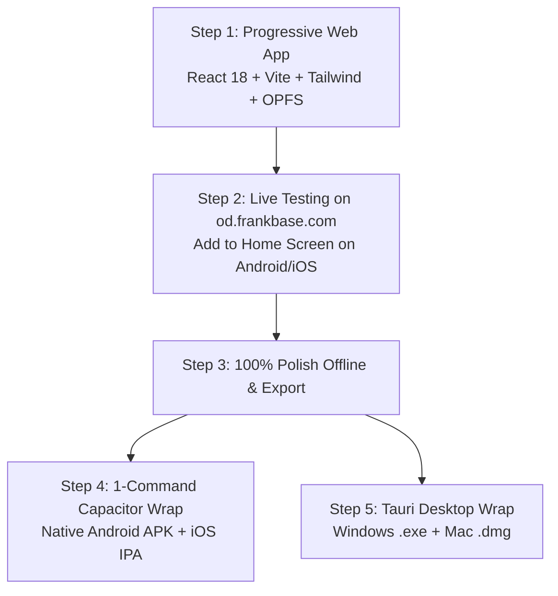

# FrankDiary (od.frankbase.com / diary.frankbase.com)
## A to Z Master Engineering & Product Implementation Plan

**Author & Founder:** Master Manikant Yadav  
**Architecture Classification:** Offline-First, Zero-Knowledge E2EE, PWA-to-Native Hybrid  
**Status:** Frozen Blueprint Ready for Step-by-Step Execution  

---

## 1. Core Feature Innovations & Mechanics

### 1.1 Multi-Tier Unlock Options
The application provides complete flexibility in how the vault is secured:
* **Option A: Biometric Only** (Fingerprint / Face ID via WebAuthn on web; BiometricPrompt on native mobile).
* **Option B: PIN Only** (4-to-8 digit secure numeric pin hashed locally via Argon2id).
* **Option C: Biometric + PIN Combined** (Two-factor local security for ultra-sensitive vaults).
* **Option D: Device Screen Lock** (Delegated to OS-level system authentication credentials).
* **Option E: FrankPass Master Key Paste** (Full 256-bit passphrase directly copied from `frankpass.com` with instant auto-clipboard clearing).

### 1.2 Time-Delayed Secret Question Reset (The Anti-Intruder Shield)
* **Secret Question Scope:** Strictly barred from directly decrypting or unlocking daily entries. It exists **solely as an emergency reset trigger**.
* **Time-Lock Delay Window:** During onboarding, the user defines a reset delay (e.g. 24 hours, 48 hours, or 72 hours).
* **Active Intrusion Alert Banner:** 
  * If an unauthorized party (friend, family member, colleague) gains temporary physical possession of the phone and correctly answers the secret question, **the password does NOT reset immediately**.
  * The application enters a "Pending Reset State" displaying a bold, persistent warning banner:
    > *"⚠️ Security Alert: A password reset request was initiated via secret question on Sep 7 at 11:30 AM. Password will reset in 23 hours 45 minutes. If this was not you, tap [CANCEL RESET IMMEDIATELY]."*
  * When the real owner unlocks the app via fingerprint or PIN, they immediately detect the unauthorized attempt, cancel it with 1 click, and revoke access.

### 1.3 FrankPass Ecosystem Bridge
* Seamless integration with `frankpass.com` and FrankPass browser extension (`07_frankpass.com`).
* Dedicated "Paste FrankPass Key" button with visual paste feedback and automated clipboard sanitization after 10 seconds to prevent clipboard scraping malware.

### 1.4 Device-Tagged Sync & Edit Provenance
* Every device registers an identifiable, human-readable label upon first link (e.g., "Manikant iPhone 15", "Saharsa Office PC", "Living Room iPad").
* Entries display audit provenance:
  * *"Written on Manikant iPhone 15 at 11:15 AM"*
  * *"Last modified on Saharsa Office PC at 04:30 PM"*
* Complete transparent tracking with zero server-side plaintext leakage.

### 1.5 "Physical Diary Mode" (Non-Destructive Pen-and-Paper History)
In a traditional paper notebook, once words are written with ink, they cannot be digitally erased. FrankDiary captures this nostalgic, honest journaling experience:
* **Mode Toggle:** User can select in Settings:
  * **Digital Mode:** Standard clean edit and delete.
  * **Physical Diary Mode (Ink Permanence):** Words are never permanently deleted.
* **Visual Rendering for Struck-Through / Deleted Content:**
  1. **Faded Thickness & Dotted Line:** Deleted sentences are rendered with reduced opacity (thinner font) and a clean dotted strike-through line.
  2. **Collapsible Shrink Drawer:** Struck-out sentences shrink into a clean, minimalist inline badge (`[3 crossed-out words ▾]`). Clicking expands the history so the page remains uncluttered while preserving complete historical honesty.

---

## 2. Platform Delivery Strategy: PWA-First to Native Wrap

### Why PWA-First is 100% the Right Choice:
1. **Zero Deployment Friction:** We can launch `od.frankbase.com` immediately on Cloudflare Pages. You can test it on your personal Android phone and PC in seconds by clicking "Install App / Add to Home Screen".
2. **Zero App Store Delays:** No waiting for Google Play Console approvals or Apple Developer certificate reviews during initial development.
3. **Identical Codebase:** When the PWA is perfected, **Capacitor 6** wraps the exact same code into a native `.apk` with zero code rewriting, automatically adding native Keystore and BiometricPrompt bindings!

---

## 3. The 3-Phase Roadmap (What to Build Now vs. Later)

### Phase 1: The Offline Masterpiece (BUILD NOW - Immediate Focus)
* PWA with full Day/Night theme (WCAG AA compliant).
* Multi-option lock (Fingerprint, PIN, Screen Lock, FrankPass Paste).
* Time-delayed secret question reset with persistent warning countdown banner.
* Rich text editor with **Physical Diary Mode** (dotted strike-through and shrink drawer).
* Per-day / per-entry SQLite WASM with OPFS local encrypted storage.
* Single-click **Authenticated Encrypted Backup (.fbe / JSON)** export and import.

### Phase 2: Device-Aware Zero-Knowledge Cloud Sync (NEXT)
* Cloudflare Workers API + D1 event log + R2 encrypted media.
* Device naming ("Phone", "Laptop") and timestamp synchronization.
* Non-destructive conflict-copy resolution.

### Phase 3: App Store & Desktop Release (LATER)
* Android APK generation via Capacitor + Google Play submission.
* Windows / Mac desktop app via Tauri.
* Dodo Payments pro cloud subscription activation.
