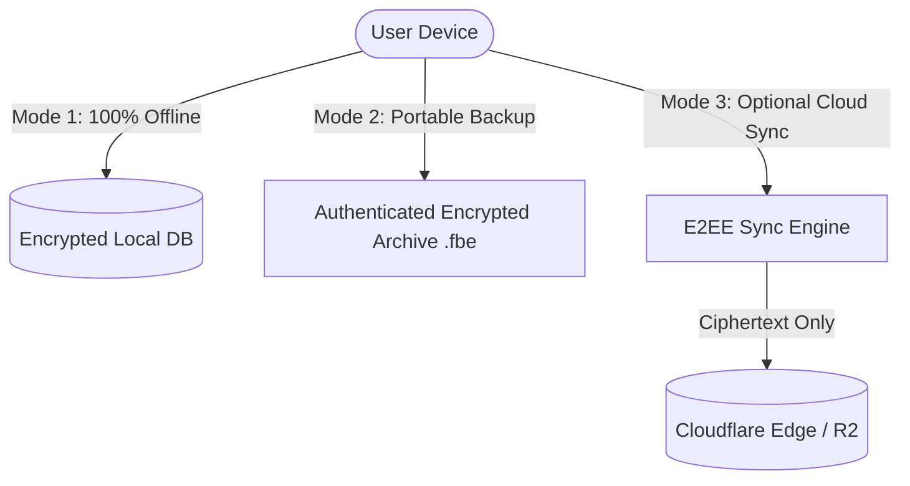

# 01. Product Overview: FrankBase Offline-First Encrypted Diary (FrankDiary / OOD)

## 1. Executive Summary & Vision

**FrankDiary** (working domains: `od.frankbase.com` / `ood.frankbase.com` / canonical recommendation: `diary.frankbase.com`) is a privacy-first, offline-first personal diary, reflective journaling, and sensitive note-vault platform. The system is engineered on a zero-knowledge, end-to-end encrypted (E2EE) foundation where **the user retains exclusive cryptographic control of their decryption keys**. 

The core operating tenet of the product is:
> **“Your data belongs to you. The server stores ciphertext, not readable personal information.”**

Unlike conventional web or mobile journaling platforms where cloud servers process and store user thoughts in plaintext or with server-held keys ("encryption-at-rest" managed by cloud providers), FrankDiary enforces **client-side authenticated encryption** before any data ever touches persistent local disk storage or traverses a network interface.

---

## 2. The Core Problem Statement

Personal diaries, journals, and private notes contain humanity's most intimate, vulnerable, and confidential records:
* Deep personal reflections, mental health disclosures, emotional states.
* Private financial plans, interpersonal relationships, family life.
* Unfiltered intellectual property, startup ideas, passwords, and medical logs.

### The Modern Cloud Vulnerability Reality:
1. **Server-Side Data Breaches:** Billions of records are exposed annually via SQL injections, misconfigured S3 buckets, rogue employees, and compromised database snapshots.
2. **Subpoenas & Gag Orders:** Traditional SaaS platforms can be compelled under domestic or international warrants to hand over user records in readable plaintext without user notification.
3. **Surveillance Capitalism & AI Training:** Many mainstream journaling and note-taking apps update their terms of service to scrape customer journals for LLM training and contextual profiling.
4. **Cloud Dependency & Vendor Lock-in:** If a user loses internet connectivity or the service goes bankrupt, user data is either unreachable or lost in proprietary formats.

---

## 3. Product Architecture Modes

To bridge the gap between absolute offline privacy and multi-device convenience, FrankDiary provides three explicit, decoupled operating modes:

### Mode 1 — Fully Offline Diary (Air-Gapped / Local-Only)
* **Zero Cloud Dependency:** Functions 100% without internet connectivity.
* **No Mandatory Account:** Users never need an email, phone number, or cloud profile.
* **Encrypted at Rest Locally:** SQLite/OPFS encrypted via AES-256-GCM or ChaCha20-Poly1305. The database file on the phone or PC cannot be read if extracted.
* **Ephemeral Memory Model:** Key material is kept only in volatile RAM while the vault is unlocked and purged instantly on timeout or app backgrounding.

### Mode 2 — Portable Encrypted Backups (.fbe format)
* **Self-Contained Data Portability:** Users can generate a cryptographically authenticated, encrypted archive file (`.fbe` — FrankBase Encrypted archive).
* **Storage Provider Agnostic:** The user can save, email, or upload this file to Google Drive, Dropbox, Proton Drive, local NAS, or a physical USB drive.
* **Zero Trust Third-Party Storage:** Even if the backup file is stolen from Google Drive, the file remains indistinguishable from random noise without the passphrase.
* **Standardized Specification:** Fully documented, open specification to guarantee users can decrypt and export to Markdown/JSON in 20 years even if the company ceases to exist.

### Mode 3 — Optional Online + Offline Cloud Synchronization
* **Blind Cloud Synchronization:** For users with multiple devices (e.g., iPhone, Android, MacBook, Windows PC), data syncs seamlessly via Cloudflare Workers and D1/R2.
* **Ciphertext-Only Storage:** The server receives, stores, and distributes only cryptographically opaque ciphertext blobs.
* **Conflict-Free Replication:** Powered by encrypted CRDTs (Conflict-Free Replicated Data Types) or deterministic operational event-sourcing.
* **Client-Side Search:** Full-text search is computed entirely on-device across decrypted records; the server never indexes words, tags, or stems.

---

## 4. Domain & Brand Architecture Analysis

The user suggested `od.frankbase.com` ("Offline Diary") and `ood.frankbase.com` ("Offline & Online Diary"). Let us evaluate branding, memorability, typography, and UX:

| Option | Phonetics / Typing | Meaning | Recommendation Score | Rationale |
| :--- | :--- | :--- | :--- | :--- |
| `od.frankbase.com` | 2 characters, punchy | **O**ffline **D**iary / **O**wn **D**ata | **9.2 / 10** | Very clean, easy to remember, feels like a discrete utility tool. |
| `ood.frankbase.com` | 3 characters, double 'o' | **O**ffline & **O**nline **D**iary | **6.5 / 10** | Double 'o' creates phonetic ambiguity ("wood", "odd", or "o-o-d"). Users frequently typo it as `od` or `oodd`. |
| `diary.frankbase.com` | Full descriptive word | FrankBase Diary | **9.8 / 10** | Instantly conveys purpose to non-technical users and search engines. |

### Architectural Recommendation on Domains:
* **Primary Production Domain:** `diary.frankbase.com` (or `od.frankbase.com`).
* **Technical Dual-Route Strategy:** Bind both `od.frankbase.com` and `ood.frankbase.com` as DNS aliases (Cloudflare Edge CNAMEs) redirecting or mapping cleanly to the primary application. 
* In user messaging: **“FrankDiary: Offline by default, sync when you choose.”**

---

## 5. Non-Negotiable Engineering Principles

1. **Client-Side Cryptographic Boundary:** No plaintext diary entry, title, tag, mood indicator, or audio recording may ever cross the network boundary.
2. **Deterministic Zero-Knowledge:** The server architecture must possess zero mathematical capability to derive the user's data encryption keys.
3. **No Unencrypted Analytics:** Third-party analytics SDKs (Google Analytics, Mixpanel, Firebase, Meta Pixel) that capture DOM changes, keystrokes, or screen states are strictly barred from the codebase.
4. **Open Specifications & Source Verification:** Every cryptographic routine must use audited, peer-reviewed primitives and published open-source client implementations with reproducible builds.
5. **Vendor Independence:** The system must never hold user data hostage; instantaneous 1-click plaintext export (decrypted locally into open JSON, Markdown, and PDF formats) is guaranteed at all times.
