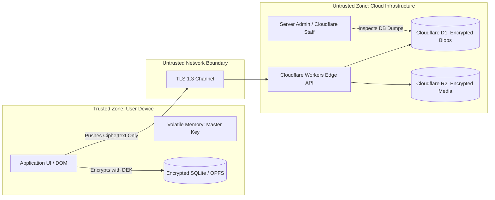

# 02. Formal Threat Model & Security Qualifications

## 1. Threat Modeling Methodology & Trust Boundaries

The security analysis of FrankDiary follows the **STRIDE model** (Spoofing, Tampering, Repudiation, Information Disclosure, Denial of Service, Elevation of Privilege) combined with a rigorous **Zero-Trust Client-Side Cryptographic Boundary**.

---

## 2. Detailed Threat Actor Analysis (Scenarios A through I)

| Threat Actor | Access Level / Capabilities | Can They Read Plaintext Diary? | Security Mechanism / Defense in Depth | Residual Risks & Limits |
| :--- | :--- | :---: | :--- | :--- |
| **A. Database Attacker** | Obtains complete SQL dump, D1 database snapshot, or R2 bucket extract. | **NO** | All diary records, titles, and media are ciphertext encrypted with AES-256-GCM / ChaCha20-Poly1305. Nonce and tag are stored, but keys are never stored on the server. | Brute force against weak user passwords if KDF parameters are too low. (Mitigated by Argon2id memory-hard parameters). |
| **B. Server Administrator** | Root/admin access to production servers, Cloudflare dashboard, and edge logs. | **NO** | Zero-knowledge architecture. Server processes only ciphertext payloads (`nonce`, `ciphertext`, `tag`). Server never holds decryption keys. | Administrator can perform Denial of Service (delete accounts) or traffic analysis (record timestamps/IPs). |
| **C. Developer** | Full access to source code, GitHub repository, and CI/CD deployment pipelines. | **NO** (in current runtime) / **CONDITIONAL** (via update) | Developer cannot read existing ciphertext in database without the user's passphrase. | If a rogue developer pushes a malicious build to the app store / web server, the modified client could exfiltrate keys (see Scenario H). |
| **D. Cloud Provider** | Hypervisor control, physical disk access, infrastructure memory scraping. | **NO** | Storage at rest on cloud servers is opaque ciphertext. Compute workers only route byte streams. | Traffic metadata (request frequency, IP, payload size) is visible to the cloud provider. |
| **E. Network Attacker** | Man-in-the-Middle (MitM), rogue WiFi, ISP packet capture, forged CA certs. | **NO** | Double layer: TLS 1.3 transport encryption + Application-Layer End-to-End Encryption (AEAD). | If TLS is broken via rogue root CA on corporate devices, attacker sees only ciphertext blobs, not plaintext entries. |
| **F. Stolen Backup** | Backup file (`.fbe`) stolen from Google Drive, Dropbox, USB drive, or NAS. | **NO** | Backup files are authenticated encrypted archives sealed with user passphrase-derived Argon2id master key. | Vulnerable to offline dictionary attacks if the user chose a trivial password (e.g. `password123`). |
| **G. Compromised Device** | Attacker has physical possession of an unlocked, booted device. | **YES** (if unlocked) / **NO** (if locked & RAM purged) | Auto-lock timers, background RAM purge, secure enclave key protection, Android Keystore / iOS Keychain hardware backing. | If an attacker grabs an unlocked device with the diary open on screen, software encryption cannot prevent optical viewing or DOM scraping. |
| **H. Malicious Application Update** | Attacker compromises app store account, web hosting, or build pipeline to push trojaned code. | **CRITICAL RISK** (Could exfiltrate plaintext) | Subresource Integrity (SRI), Reproducible Builds, Code Signing, Pinned Releases, Dual-Signoff CI/CD, Content Security Policy (CSP). | If malicious client code runs in the user's execution environment, it can hook the password input field and capture keys before encryption. |
| **I. User Password Compromise** | Attacker obtains the user's exact master passphrase (via phishing, keylogger, shoulder surfing). | **YES** | System cannot distinguish authorized user from attacker with valid credentials. (Optional: Hardware FIDO2/WebAuthn 2FA). | If the passphrase is compromised, encryption yields to the attacker. |

---

## 3. Answers to the 10 Critical Security Qualification Questions

### 1. Can such an architecture actually be built?
**YES.** Real-world, peer-reviewed production examples exist (Signal, Bitwarden, Standard Notes, 1Password, Proton). In these architectures, key derivation and cryptographic operations occur exclusively on client runtimes using established cryptographic libraries.

### 2. Against which threat models does it protect?
It successfully defends against:
* Mass database dumps and server storage breaches.
* Compromised cloud hosting providers, storage bucket leaks, and rogue database administrators.
* Network interception, Wi-Fi sniffing, and ISP surveillance.
* Cloud subpoena/warrant compliance for plaintext content (servers can only produce unreadable ciphertext).
* Third-party cloud storage leaks (Google Drive, Dropbox, NAS) when storing `.fbe` backup files.

### 3. Under what conditions is protection NOT possible?
Protection **FAILS** under the following conditions:
* **Compromised Client Endpoint:** Active keyloggers, rootkits, memory inspection malware (Pegasus, info-stealers) running on the user's operating system.
* **Trivial Passphrase Selection:** If a user selects a 6-character common dictionary word, offline brute-force attacks against stolen ciphertext will succeed.
* **Shoulder Surfing / Screen Capture:** Physical viewing while the diary is in an active, unlocked state.
* **Compromised Software Supply Chain:** If the binary or web bundle downloaded by the user has been silently modified to log or transmit plaintext.

### 4. What happens if an attacker gets the user's unlocked device?
If the device is actively unlocked and the diary application is currently in an active session:
* The attacker can read any entry currently rendered on screen.
* If the master key is temporarily in RAM, an attacker with physical USB debugging/root access could dump RAM.
* **Mitigation:** The application must enforce an aggressive background timeout (e.g., 60 seconds inactivity), biometric re-prompting (BiometricPrompt / LocalAuthentication), disable OS-level screenshots/window previews (`FLAG_SECURE` on Android), and explicitly zero out key memory buffers (`crypto.subtle` / TypedArray `buffer.fill(0)`).

### 5. What happens if an attacker installs a malicious modified application?
If an attacker installs a trojaned version of FrankDiary on the device:
* The attacker's code runs in the client context and can easily record the master passphrase when typed.
* All cryptographic guarantees collapse at that point because the client execution environment is compromised.
* **Defense:** OS-level app signature verification (Google Play Protect, iOS Gatekeeper), strictly signing APKs/IPAs, and warning users never to sideload unverified builds.

### 6. If the user forgets their password, how does recovery work?
In a mathematically sound Zero-Knowledge E2EE system:
* **The server CANNOT reset or recover the password.** There is no "Forgot Password? Click here to receive a reset link" that decrypts existing data.
* **Recovery Mechanism:** During initial vault creation, the application generates a cryptographically random **24-word BIP-39 Recovery Phrase** (or a 256-bit emergency recovery key).
* An encrypted copy of the Master Key is wrapped with this Recovery Key. If the user loses both their password AND their recovery sheet, **their data is permanently lost**. This must be communicated with 100% clarity.

### 7. Is password reset possible without breaking the encryption architecture?
* **Resetting Password WITH Recovery Key:** YES. The recovery key unwraps the Master Key, which is then re-wrapped with the new password. No data re-encryption is needed.
* **Resetting Password WITHOUT Recovery Key / Old Password:** NO. The only option is an **Account Reset**, which wipes the encrypted vault and starts a blank slate. Any attempt by a server to reset the password without the user's secret proves that the server was holding the keys (violating E2EE).

### 8. Can a developer access plaintext via a future application update?
* **Technically YES, unless prevented by architecture.** In any web or mobile app, whoever controls the app update channel controls the code executed on the user's machine. A malicious update could deploy code that reads `document.getElementById('password').value` and sends it to an attacker's webhook.
* **Mitigation:**
  1. **Open Source & Reproducible Builds:** Code on GitHub must compile to bit-for-bit identical binaries.
  2. **Strict Content Security Policy (CSP):** Prevent web clients from connecting to unauthorized domains (`connect-src 'self' https://api.frankbase.com`).
  3. **Multi-Party Code Signing:** Require multiple hardware keys (YubiKeys) for pushing production releases.
  4. **PWA / Native App Caching:** Offline PWAs and native apps do not update automatically on every page refresh without user interaction.

### 9. Can the server compromise data by sending malicious ciphertext or updates?
* **Malicious Ciphertext:** The server cannot compromise plaintext confidentiality by injecting garbage ciphertext. The client uses **Authenticated Encryption with Associated Data (AEAD)**. Any tampering or corrupted ciphertext will fail authentication tag validation and be immediately rejected with an integrity error (`HMAC/Poly1305 check failed`).
* **Malicious Updates:** If the server dynamically injects malicious JavaScript, it can compromise the client. Hence, web updates must be strictly version-controlled, signed, and audited.

### 10. Can reverse engineering be completely prevented?
* **ABSOLUTELY NOT.** Claiming "reverse engineering is impossible" is fraudulent security marketing.
* Any code running on client hardware (JavaScript, WebAssembly, Android DEX, ARM binaries) can be decompiled, disassembled, hooked (e.g., via Frida, Ghidra, Chrome DevTools), and analyzed.
* **The Open Source Cryptographic Philosophy (Kerckhoffs's Principle):**
  > *"A cryptographic system should be secure even if everything about the system, except the key, is public knowledge."*
* FrankDiary **welcomes** reverse engineering: all cryptography is open source. Security relies on mathematical intractability (256-bit keys, Argon2id computational hardness), NOT security through obscurity.

---

## 4. Evaluation of Marketing Claims vs. Technical Truth

| Proposed Claim | Scientific Verdict | Technically Correct Security Statement |
| :--- | :--- | :--- |
| *"Nobody can read your data without your password."* | **Partially Achievable** | "Nobody can decrypt your stored data without your passphrase or your offline emergency recovery key, assuming an uncompromised client device." |
| *"The developer cannot read your data."* | **Fully Achievable** (for database) / **Conditional** (for updates) | "The developer has zero mathematical access to your encrypted vault on the server. To maintain this, verify application builds independently." |
| *"The server owner cannot read your data."* | **Fully Achievable** | "The server owner stores and processes only ciphertext blobs; decryption keys never leave your device." |
| *"Cloud providers cannot read your data."* | **Fully Achievable** | "Cloud infrastructure providers (Cloudflare, AWS) only host encrypted byte arrays and cannot access the underlying plaintext." |
| *"If the database leaks, your data is 100% safe."* | **Depends on Threat Model** | "If the database is leaked, encrypted data cannot be decrypted unless the attacker successfully brute-forces your master passphrase. Strong passphrases resist all known computational attacks." |
| *"Reverse engineering cannot bypass our encryption."* | **Not Realistically Achievable** (Misleading premise) | "Reverse engineering the application reveals only public mathematical algorithms, not your secret keys. Your security depends on cryptographic key strength, not code secrecy." |
| *"Even the application owner cannot see your data."* | **Fully Achievable** | "The application architecture is Zero-Knowledge. Decryption keys are derived exclusively in device memory and are never transmitted." |
