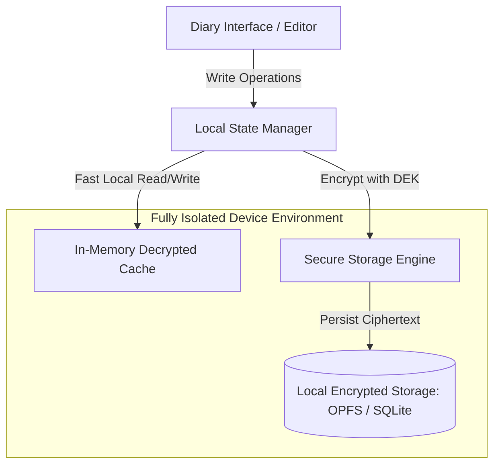

# 05. Offline-First Architecture & Local Encrypted Storage

## 1. The Offline-First Paradigm: Local Autonomy

FrankDiary is built upon the **Local-First Software Foundation** (Kleppmann et al., 2019). The application considers the local device storage as the **primary, authoritative source of truth**, with the network operating purely as an optional asynchronous replication stream.



### Core Offline Guarantees:
1. **Zero Network Latency:** Writing, reading, searching, and editing operate instantaneously at 0ms network latency.
2. **Infinite Offline Durability:** The application works indefinitely without ever connecting to Wi-Fi or cellular networks.
3. **No Account Requirement:** Users can download the app/PWA, set an offline passphrase, and begin writing immediately without submitting an email address or username.

---

## 2. Local Storage Technology Evaluation

| Technology | Platform Suitability | Encryption Mechanism | Read/Write Throughput | Query Capabilities | Max Capacity | Recommendation for FrankDiary |
| :--- | :--- | :--- | :--- | :--- | :--- | :---: |
| **IndexedDB (Raw)** | All Modern Browsers | Field-level encryption in JS | Moderate (~15-30 MB/s) | Key-value / Object store | High (~60% of disk) | Acceptable fallback |
| **Official SQLite WASM + OPFS** | Modern Browsers (Chrome 102+, Safari 16.4+, Firefox 111+) | VFS-level or page-level AEAD encryption | **Very High (~120-250 MB/s)** via OPFS SyncAccessHandle | **Full SQL + FTS5** | **Gigabytes** (High quota) | **PRIMARY WEB CHOICE** |
| **SQLCipher (Native C/C++)** | Android, iOS, macOS, Windows, Linux | 256-bit AES full page encryption at rest | **Maximum (>300 MB/s)** | Full SQL | Full disk space | **PRIMARY NATIVE CHOICE** |
| **Plain Filesystem (JSON/MD)** | Desktop (Tauri/Electron) | File-by-file AEAD encryption | High | Requires manual indexing | Full disk space | Excellent for export |

---

## 3. SQLite WASM with Origin Private File System (OPFS)

For Web / PWA environments, FrankDiary leverages the official **SQLite Wasm with Origin Private File System (OPFS)**:
* **Private Sandboxed Storage:** OPFS provides a fast, private filesystem sandbox accessible only to the origin (`diary.frankbase.com`).
* **Direct File System Access Handle (`SyncAccessHandle`):** Inside a Web Worker, SQLite reads and writes directly to native OS disk blocks with atomic transactional integrity (ACID).
* **Cross-Tab Concurrency:** Multiple tabs of the diary can query the same local database safely using SQLite's built-in file locking mechanisms.

---

## 4. On-Disk Local Encryption Architecture

Even on an offline device, if an attacker steals the phone or PC, extracting the SQLite file must not reveal the diary content.

### Implementation Patterns:
1. **Option A: Full Database Encryption (SQLCipher):**
   * Encrypts every SQLite database page (4096 bytes) with AES-256-CBC and HMAC-SHA512.
   * Header bytes, page indexes, and B-trees are completely scrambled.
   * An attacker opening the `.db` file with a hex editor sees only random bytes.
2. **Option B: Application-Level AEAD Page/Record Encryption (WASM Architecture):**
   * In browser environments where compiling full SQLCipher in WASM is heavy (~3MB), the application stores encrypted blobs in a standard SQLite schema:
     ```sql
     CREATE TABLE entries (
         id TEXT PRIMARY KEY,
         created_at INTEGER NOT NULL,
         updated_at INTEGER NOT NULL,
         nonce BLOB NOT NULL,
         ciphertext BLOB NOT NULL,
         auth_tag BLOB NOT NULL
     );
     ```
   * Only timestamps and UUIDs exist in cleartext for indexed sorting; all text, titles, tags, and media reside in `ciphertext`.

---

## 5. Client-Side Full-Text Search (Zero-Knowledge Search)

Because the cloud server never sees plaintext, server-side search is impossible. Full-text search must happen **100% on the client**.


### Search Implementation Strategy:
1. **In-Memory Decrypted Index (MiniSearch / FlexSearch):**
   * When the user unlocks their vault, the app decrypts the lightweight metadata and text tokens into an ephemeral in-memory inverted index (`MiniSearch`).
   * Memory footprint: A journal of 5,000 entries (~5 million words) consumes only ~12 MB of RAM for the search index.
   * Search speed: Queries return ranked BM25 search results in **under 15 milliseconds**.
2. **Ephemeral Lifecycle:** When the vault locks or the user navigates away, the index is immediately purged from RAM.
3. **Encrypted Persistent Index (Native SQLite FTS5):**
   * In SQLCipher native apps, the SQLite FTS5 extension is enabled inside the encrypted database file. Queries run natively in encrypted SQL without keeping the entire journal in memory.

---

## 6. Performance, Storage Quota & Battery Optimization

1. **Storage Quotas:**
   * Modern desktop browsers allocate up to 60% of free disk space to OPFS.
   * A text-only diary with 10,000 entries (each 500 words) occupies roughly **15 to 25 Megabytes**.
   * Photos and audio attachments are dynamically compressed on-device (e.g. converting images to WebP/AVIF and audio to Opus) before encryption, saving 70% of storage.
2. **Battery & CPU Conservation:**
   * Key derivation (Argon2id) runs **only once** upon unlocking the vault.
   * Ongoing entry edits use symmetric AES-256-GCM / ChaCha20, which consumes less than 0.1% CPU on modern mobile silicon.
   * Zero background battery drain because no persistent background websockets or polling loops are active when offline.
