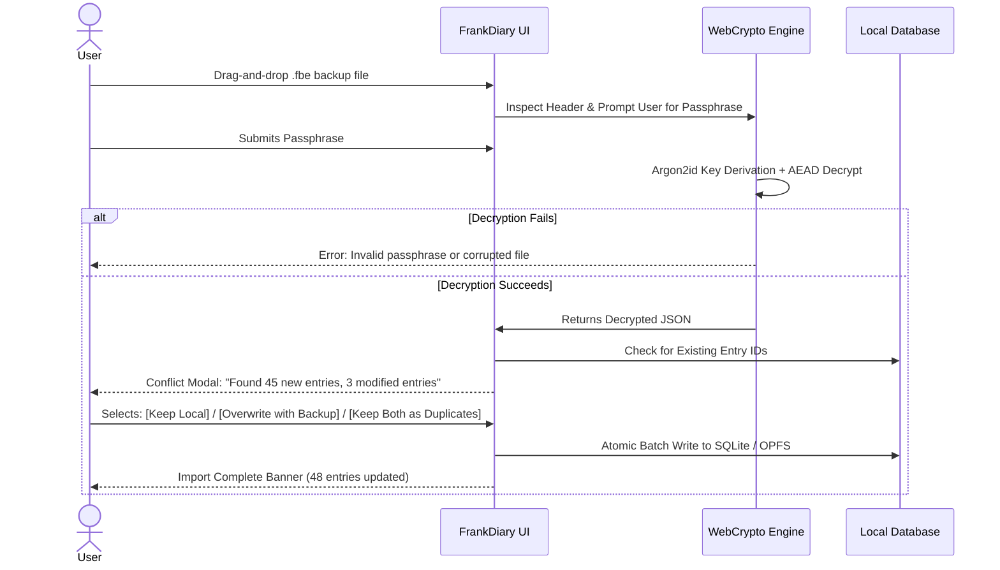

# 06. Portable Encrypted Backup & Universal Export/Import Format

## 1. Objective & Philosophy of Portable Backups (Mode 2)

Mode 2 allows users to create **cryptographically sealed, self-contained backup archives** (`.fbe` — FrankBase Encrypted archive) that can be safely transferred to any untrusted external media:
* Google Drive, Microsoft OneDrive, Dropbox
* External USB flash drives, SD cards, local Network Attached Storage (NAS)
* Sent via email attachment or AirDrop

The file is immune to inspection by third-party storage hosts. Even if a cloud provider's storage is breached or an employee inspects files, the `.fbe` file remains an impenetrable mathematical cipher.

---

## 2. Specification of the `.fbe` Container Format (v1.0)

To avoid proprietary lock-in while guaranteeing cryptographic integrity, FrankDiary defines an open binary container standard:

```
+-----------------------------------------------------------------------+
|                       FRANKDIARY BACKUP CONTAINER                     |
+-------------------+--------------------+------------------------------+
| MAGIC (4 Bytes)   | VERSION (2 Bytes)  | KDF TYPE (1 Byte)            |
| "FBED"            | 0x0001             | 0x01 (Argon2id)              |
+-------------------+--------------------+------------------------------+
| KDF PARAMS (12 Bytes): Memory (4B), Iterations (4B), Parallelism (4B) |
+-----------------------------------------------------------------------+
| SALT (16 Bytes): Cryptographically secure random salt                 |
+-----------------------------------------------------------------------+
| CIPHER TYPE (1 Byte)                   | NONCE / IV (12 or 24 Bytes)  |
| 0x01 = AES-256-GCM, 0x02 = XChaCha20   | Random IV                    |
+----------------------------------------+------------------------------+
| PAYLOAD LENGTH (8 Bytes, Big-Endian uint64)                           |
+-----------------------------------------------------------------------+
| CIPHERTEXT BLOB: (Compressed DEFLATE payload containing JSON/media)   |
| ...                                                                   |
+-----------------------------------------------------------------------+
| AUTHENTICATION TAG (16 Bytes): Poly1305 or GCM Tag                    |
+-----------------------------------------------------------------------+
```

### Inner Decrypted Payload Structure:
When decrypted, the inner payload is an open, human-readable JSON archive accompanied by media assets:
```json
{
  "generator": "FrankDiary v1.0.0",
  "export_date": "2026-09-07T10:00:00Z",
  "schema_version": 1,
  "vault_id": "8f6d2b34-11e2-4f67-a9a8-e7b99c8f0012",
  "entries_count": 342,
  "entries": [
    {
      "id": "e91b4520-21a4-4a27-a068-912a7d451101",
      "created_at": 1788775200000,
      "updated_at": 1788775200000,
      "title": "Reflections on Privacy and Autonomy",
      "content_markdown": "# Personal Freedom\nToday I completed...",
      "tags": ["thoughts", "philosophy", "tech"],
      "mood": "calm",
      "attachments": [
        {
          "filename": "sunset.webp",
          "mime_type": "image/webp",
          "data_base64": "UklGRiQAAABXRUJQVlA4..."
        }
      ]
    }
  ]
}
```

---

## 3. Comparative Evaluation: Custom `.fbe` vs. `age` vs. OpenPGP

| Standard | Advantages | Disadvantages | FrankDiary Decision |
| :--- | :--- | :--- | :--- |
| **OpenPGP / GPG** | 30+ year standard, widespread tooling. | Extreme legacy complexity, malleable packets, poor KDF (S2K), memory-unsafe implementations. | ❌ Rejected for primary format. |
| **age encryption tool (RFC draft)** | Modern, minimalist, audited (Filippo Valsorda), uses X25519 & ChaCha20-Poly1305. | Requires external CLI binaries; complex to wrap with structured metadata inside browsers. | ⚠️ Highly compatible reference design. |
| **FrankDiary `.fbe` (Standardized Spec)** | Zero external dependencies, pure WebCrypto compatible, native envelope metadata, single-file drag-and-drop. | Custom file extension (though specification is 100% open source). | ✅ **PRIMARY ARCHIVE STANDARD** |

---

## 4. Tampering & Corruption Detection Protocol

Data integrity during file transfers (e.g., incomplete downloads, bad sectors on USB drives) is guaranteed by the AEAD design:

1. **Authentication Tag Verification:** Before parsing any JSON or extracting files, the AEAD engine checks the 16-byte authentication tag against the full ciphertext and header bytes.
2. **Atomic Failure:** If even one byte of the header or ciphertext is altered, decryption halts with a clear error:
   > *"Authentication failed: The backup file has been corrupted or tampered with, or the passphrase was entered incorrectly."*
3. **Zero Partial Plaintext Leakage:** The application never outputs half-decrypted data from a tampered archive.

---

## 5. Unencrypted Multi-Format Export (Zero Vendor Lock-in)

To guarantee that users never feel trapped inside FrankDiary, the application provides instantaneous, local plaintext export options:

1. **Markdown + YAML Frontmatter ZIP:**
   * Each diary entry is saved as an individual `.md` file:
     ```markdown
     ---
     title: "Reflections on Privacy"
     date: 2026-09-07T10:00:00Z
     tags: [thoughts, philosophy]
     mood: calm
     ---
     # Personal Freedom
     Today I completed...
     ```
   * Attachments are stored in an adjacent `/attachments/` folder.
   * Compatible out of the box with **Obsidian, Logseq, Bear, and standard file managers**.
2. **Open Standard JSON:** Complete database structure exported in human-readable, machine-parsable JSON.
3. **Printable PDF Book:** Generates a clean, typography-optimized PDF journal for printing or physical binding.

---

## 6. Secure Import & Conflict Resolution Workflow

When a user imports an `.fbe` file into an existing diary instance:


