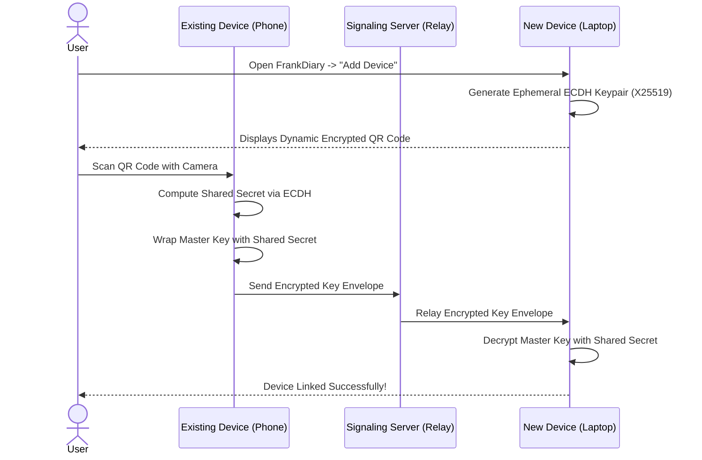

# 07. End-to-End Encrypted Cloud Synchronization (Mode 3)

## 1. The Challenge of Zero-Knowledge Synchronization

In conventional cloud architectures (e.g., Google Keep, Notion), the server parses database records, calculates diffs, and resolves conflicts. 

In FrankDiary's zero-knowledge architecture:
* **The server is blind:** It cannot parse words, characters, or timestamps inside entries.
* **The server cannot merge conflicts:** The server cannot execute 3-way merges on encrypted blobs.
* **Client Autonomy:** All synchronization mathematics, conflict resolution, and history stitching must occur **entirely on client endpoints**.

```mermaid
graph TD
    subgraph Device A (Phone)
        LocalA[(Local DB)] --> CryptoA[Encrypt Changes]
        CryptoA --> OutQueueA[Encrypted Outbox]
    end

    subgraph Blind Cloud Relay (Cloudflare Workers)
        API[Edge Sync API]
        D1[(Event Log: D1)]
        R2[(Encrypted Media: R2)]
    end

    subgraph Device B (Laptop)
        InQueueB[Encrypted Inbox] --> CryptoB[Decrypt Changes]
        CryptoB --> LocalB[(Local DB)]
    end

    OutQueueA -->|Push Encrypted Event| API
    API --> D1
    API -->|Pull New Events| InQueueB
```

---

## 2. Synchronization Architecture & Data Models

FrankDiary adopts an **Encrypted Append-Only Event Stream (Log-Structured Replication)** combined with **Lamport Logical Clocks**:

### The Encrypted Sync Event Schema:
```typescript
interface EncryptedSyncEvent {
  event_id: string;        // UUIDv4 (Random, reveals no content)
  vault_id: string;        // Hashed Vault Identifier (HMAC)
  device_id: string;       // Public device identity token
  lamport_clock: number;   // Logical monotonic integer counter
  entity_type: 'entry' | 'attachment' | 'tag' | 'key_rotation';
  entity_id: string;       // Deterministic UUID for the diary entry
  operation: 'UPSERT' | 'DELETE';
  nonce: string;           // Base64 96-bit / 192-bit nonce
  ciphertext: string;      // Base64 encrypted payload (contains encrypted fields & title)
  auth_tag: string;        // Base64 128-bit authentication tag
  client_timestamp: number;// Encrypted inside the ciphertext envelope
  server_received_at: number; // Server epoch timestamp (for rate limiting only)
}
```

---

## 3. Conflict Resolution Protocols

When a user edits the same diary entry simultaneously on their phone (offline on an airplane) and their laptop:

### Method 1: Last-Write-Wins (LWW) via Lamport Logical Clocks
* Each client maintains a monotonically increasing integer clock ($L$).
* Upon any edit: $L_{\text{new}} = \max(L_{\text{local}}, L_{\text{received}}) + 1$.
* If an event arrives with a higher Lamport clock, it becomes the active state.
* **Tie-Breaking:** If clocks match, the device with the lexicographically higher `device_id` wins deterministically.

### Method 2: Non-Destructive Forking ("Conflict Copies")
* Diary entries are intimate, long-form thoughts; silently overwriting an edit because of a clock difference is unacceptable.
* **FrankDiary Safety Guarantee:** If two edits overlap during an offline window, the system **never deletes either version**.
* It preserves the primary version and automatically creates a child entry:
  > *"Reflections on Privacy (Conflicted Copy from iPhone - 2026-09-07)"*
* The user is notified with a polite UI prompt to merge or delete the duplicate.

### Method 3: Encrypted CRDTs (Conflict-Free Replicated Data Types)
* For rich text collaboration or intra-entry character merges, FrankDiary evaluates **Yjs / Automerge state vectors**.
* State vectors are serialized into binary chunks, encrypted on-device, and synchronized blindly through the server event queue.

---

## 4. Handling Deletions: Cryptographic Erasure & Tombstones

In distributed offline databases, simply deleting a row locally causes it to reappear when syncing with other devices that still hold the record.

1. **Encrypted Tombstones:**
   * A deletion is represented as a sync event with `operation: 'DELETE'`.
   * The ciphertext contains an encrypted confirmation: `{"deleted": true, "deleted_at": 1788775200000}`.
   * Other devices receive the tombstone, delete their local entry, and hide it from the UI.
2. **Server-Side Hard Purge:**
   * After 30 days of tombstone propagation, a client-initiated purge cleans the underlying event log from Cloudflare D1 and R2, executing permanent cryptographic erasure.

---

## 5. Encrypted Attachments & Large Media Streaming

Photos and voice recordings can easily exceed database limits.

1. **Direct-to-R2 Pre-Signed Encrypted Uploads:**
   * Device A compresses the image (WebP/AVIF) and generates a random 256-bit Media Key ($K_m$).
   * Device A encrypts the binary file with $K_m$ using AES-256-GCM.
   * Device A requests a one-time pre-signed PUT URL from the Cloudflare Worker.
   * Device A streams the ciphertext directly to **Cloudflare R2 Object Storage**.
2. **Key Attachment:**
   * The Media Key ($K_m$) and R2 blob hash are encrypted inside the diary entry's encrypted JSON payload.
   * Device B downloads the ciphertext from R2 and decrypts it using $K_m$ extracted from the decrypted diary record.
   * The Cloudflare R2 bucket contains only meaningless binary blobs.

---

## 6. Multi-Device Authorization & Key Transfer

How does a user securely transfer their Master Key to a second device without transmitting it in plaintext?



### Fallback Method: 24-Word Recovery Phrase
If the user cannot scan a QR code (e.g. phone was lost), they simply enter their **24-word recovery phrase** on the new device. The recovery phrase unwraps the cloud-stored wrapped DEK without requiring the old device.

---

## 7. Device Revocation & Key Rotation

If a user's phone is stolen or sold:
1. **Initiate Revocation:** On their laptop, the user navigates to `Settings -> Authorized Devices` and clicks `Revoke Device`.
2. **Session Token Blacklisting:** The server API token for that device is immediately invalidated.
3. **Cryptographic Key Rotation (Forward Secrecy):**
   * The laptop generates a fresh Data Encryption Key ($\text{DEK}_{\text{new}}$).
   * All new entries and future edits are encrypted with $\text{DEK}_{\text{new}}$.
   * Even if an attacker breaks into the stolen phone later, they cannot decrypt any future entries.
