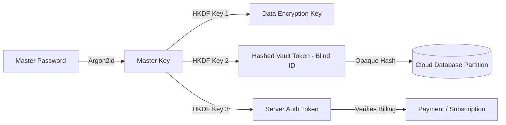

# 08. Metadata Privacy & Traffic Analysis Defense

## 1. The Metadata Reality: "Content is Only Half the Story"

A common delusion in cryptography marketing is that encrypting the text payload provides total privacy. In the words of former NSA General Counsel Stewart Baker:
> *"Metadata tells you everything about somebody's life. If you have enough metadata, you don't really need content."*

Even with unbreakable AES-256 encryption, an external observer (network eavesdropper, rogue sysadmin, or ISP) monitoring raw cloud sync traffic can deduce intimate personal patterns:
* **Circadian Rhythm & Sleep Profiling:** Sync timestamps at 2:30 AM every night indicate insomnia, late-night distress, or psychiatric episodes.
* **Emotional Crisis Inference:** A sudden burst of 20 rapid sync updates and large file uploads in a single hour suggests an acute crisis or major life event.
* **Payload Size Fingerprinting:** Knowing an uploaded blob is exactly 4.2 MB strongly indicates a smartphone camera photo, whereas a 250-byte blob indicates a short 2-sentence note.

---

## 2. Comprehensive Metadata Leakage Vector Analysis

| Metadata Vector | How It Leaks in Standard Systems | Privacy Risk Level | FrankDiary Defense & Minimization Technique |
| :--- | :--- | :---: | :--- |
| **Payload Size Fingerprinting** | Exact byte length of ciphertext is visible on wire and in database. | **HIGH** | **Cryptographic Padding (Bucket Quantization):** All text payloads are padded to fixed block boundaries (e.g. 1 KB, 4 KB, 16 KB, 64 KB). An attacker cannot distinguish a 100-word entry from a 900-word entry. |
| **Exact Sync Timestamps** | Millisecond-precision server receipt logs (`2026-09-07T02:14:32.189Z`). | **HIGH** | **Client Batching & Coarse Timestamps:** Real-time sync pushes can be delayed and batched during periodic windows. Internal timestamps inside ciphertext are encrypted; server sees only coarse sync batches. |
| **IP Address & Geolocation** | TCP/IP packet headers connecting to Cloudflare edge. | **HIGH** | **Zero-IP Logging Policy:** Cloudflare Workers configured not to store client IP addresses in database tables. Native support for Tor `.onion`, VPNs, and iCloud Private Relay. |
| **Device & Browser Fingerprint** | `User-Agent` strings, screen resolutions, hardware concurrency. | **MEDIUM** | **Header Sanitization:** API requests strip extraneous browser headers, sending only a generic client identifier (`FrankDiary-Client/1.0`). |
| **Number of Entries** | Row count in user's cloud database partition. | **MEDIUM** | **Dummy / Chaff Traffic:** Optional dummy decoy sync events and encrypted omnibus bundles where multiple small entries are aggregated into a single encrypted chunk. |
| **Image & Media EXIF Metadata** | Camera model, GPS coordinates, capture date embedded in JPEG/PNG. | **CRITICAL** | **Client-Side EXIF Stripping:** Prior to encryption, the client canvas pipeline strips all GPS coordinates, camera serial numbers, and device tags from images. |
| **File Names & Extensions** | `IMG_20260907_Depression_Pills.jpg` or `voice_memo_divorce.m4a`. | **CRITICAL** | **Total Name Obfuscation:** Original filenames are completely encrypted inside the payload envelope. In storage (R2), attachments are named purely by random UUIDs: `a8b9...f01.bin`. |

---

## 3. Cryptographic Padding & Bucket Quantization

To defeat traffic analysis based on ciphertext length, FrankDiary implements **Bucket Quantization Padding**:

$$\text{PaddedSize}(S) = \begin{cases} 
1\,024 \text{ bytes} & \text{if } S \le 1\,024 \\
4\,096 \text{ bytes} & \text{if } 1\,024 < S \le 4\,096 \\
16\,384 \text{ bytes} & \text{if } 4\,096 < S \le 16\,384 \\
65\,536 \text{ bytes} & \text{if } 16\,384 < S \le 65\,536 \\
\lceil S / 65\,536 \rceil \times 65\,536 & \text{if } S > 65\,536 
\end{cases}$$

### Padding Algorithm:
```typescript
function padPayload(plaintextBytes: Uint8Array, targetBucket: number): Uint8Array {
  const paddingLength = targetBucket - plaintextBytes.length - 2;
  const padded = new Uint8Array(targetBucket);
  
  // 2-byte header storing actual payload length
  const view = new DataView(padded.buffer);
  view.setUint16(0, plaintextBytes.length, false);
  
  // Copy actual plaintext
  padded.set(plaintextBytes, 2);
  
  // Fill remaining bytes with cryptographically secure random noise
  const noise = new Uint8Array(paddingLength);
  crypto.getRandomValues(noise);
  padded.set(noise, 2 + plaintextBytes.length);
  
  return padded;
}
```
*Because the padding is filled with cryptographically random noise prior to encryption, the resulting ciphertext reveals zero statistical entropy differences.*

---

## 4. Blind Sync Tokens & Identity Partitioning

In FrankDiary, user identity and data storage are cryptographically decoupled:



### Partitioning Guarantees:
1. **Unlinkable Billing:** The payment record (credit card / Dodo Payments customer ID) is isolated in a separate billing table that does not contain the `VaultToken`.
2. **Server-Side Blind Storage:** The storage engine indexes entries by a cryptographic hash of the vault ID:
   $$\text{StoragePartition} = \text{HMAC-SHA256}(MasterKey, \text{"frankdiary-vault-partition"})$$
3. A compromised billing database does not directly disclose which encrypted database rows correspond to which paying subscriber.
