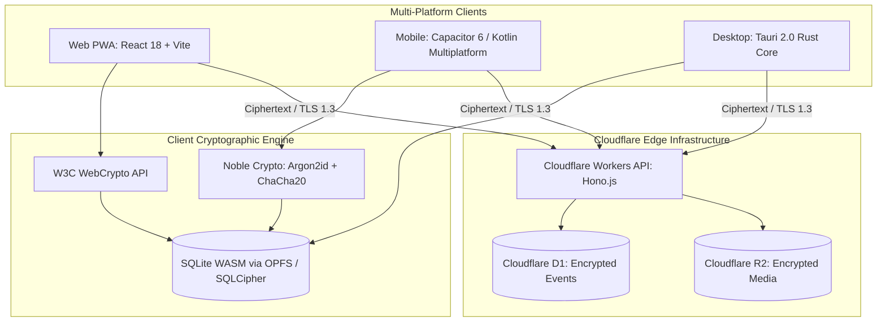

# 12. Complete Technology Stack & Engineering Specifications

## 1. Architectural Philosophy: Minimal Attack Surface & Maximum Speed

In security-critical applications, every additional line of third-party JavaScript expands the attack surface for supply-chain compromises (e.g. malicious npm dependencies). FrankDiary prioritizes **zero-dependency libraries, native browser APIs, and memory-safe compiled runtimes**.

---

## 2. Platform Technology Stack Breakdown

### A. Web Application & PWA
* **UI Framework:** **React 18 / 19** with **Vite 6** (Clean component architecture, battle-tested rendering).
* **Styling:** **Tailwind CSS v3/v4** with semantic CSS variables (`var(--bg-primary)`, `var(--text-primary)`) enforcing full Day/Night theme toggling and WCAG 2.1 AA contrast compliance (Rule 11).
* **Rich Text Editor:** **TipTap (ProseMirror Core)** or **Lexical** (Facebook) — modular, supports Markdown shortcuts, offline image drag-and-drop, and zero telemetry.
* **Service Worker:** Native PWA Service Worker (`sw.js`) with cache-first strategy for static assets and offline fallback (`offline.html`).
* **Search:** **MiniSearch** (zero-dependency in-memory inverted index, sub-15ms BM25 search over decrypted records).

### B. Mobile Applications (Android & iOS)
* **Recommended Framework:** **Capacitor v6 (Ionic Core)** with Native Biometric & Keystore Plugins.
  * *Rationale:* 95% shared code with the web PWA while executing inside a hardened WebView.
  * Integrates with `@capacitor-community/sqlite` for native SQLCipher encrypted database access.
  * Leverages native `BiometricPrompt` on Android and `LocalAuthentication` (Face ID / Touch ID) on iOS.
* **Long-Term Native Alternative:** **Kotlin Multiplatform (KMP)** for 100% native CPU performance and direct StrongBox/Secure Enclave hardware integration.

### C. Desktop Applications (macOS, Windows, Linux)
* **Framework:** **Tauri v2.0 (Rust Core + Web Frontend)**.
  * *Why Not Electron?* Electron bundles an entire Chromium browser and Node.js runtime, producing 120MB+ binaries with high RAM consumption and historical sandbox escape CVEs.
  * *Tauri Advantages:* Lightweight (<15MB executable), memory-safe Rust backend, native OS webview, uses negligible RAM (<40MB), and isolates operating system filesystem access.

---

## 3. Cryptography & Storage Layer

| Layer | Technology Selected | Rationale / Benchmark |
| :--- | :--- | :--- |
| **KDF Engine** | `@noble/hashes/argon2` + WASM fallback | Memory-hard Argon2id (RFC 9106) with 64MB RAM allocation. |
| **AEAD Symmetric Cipher** | **AES-256-GCM** (WebCrypto) + **XChaCha20-Poly1305** (`@noble/ciphers`) | Native browser hardware acceleration + extended 192-bit nonce safety. |
| **Entropy Source** | `window.crypto.getRandomValues` | Direct OS kernel CSPRNG (`/dev/urandom` / Windows CryptGenRandom). |
| **Local Web Storage** | **Official SQLite Wasm with OPFS** | Direct disk block access via `SyncAccessHandle`, full ACID transactions. |
| **Local Mobile Storage**| **SQLCipher (v4.5+)** | 256-bit AES full page encryption at rest. |

---

## 4. Backend Cloud Infrastructure (Serverless Edge)

FrankDiary's cloud sync is engineered entirely on **Cloudflare's Global Serverless Edge**:

1. **Compute (Edge Workers):**
   * **Hono.js framework:** Ultra-lightweight (sub-15KB), blazing-fast TypeScript web framework running on Cloudflare Workers.
   * Stateless, global deployment across 330+ edge locations worldwide with sub-10ms latency.
2. **Relational Database (Cloudflare D1):**
   * Serverless distributed SQLite running at the edge.
   * Stores user account records, encrypted salt/wrapped DEK, and the encrypted sync event log.
3. **Object Storage (Cloudflare R2):**
   * S3-compatible cloud storage for encrypted photos, voice recordings, and `.fbe` backup snapshots.
   * **Zero Egress Fees:** Unlike AWS S3 which charges \$0.09/GB for data egress, Cloudflare R2 has **\$0 egress costs**, dramatically reducing operational expenses.
4. **WebSocket Real-Time Signaling (Cloudflare Durable Objects):**
   * Facilitates instantaneous push notifications between online devices for instant multi-window sync.

---

## 5. Security & Quality Assurance Testing Stack

1. **Unit & Integration Testing:** **Vitest** (Fast execution, native ESM/TypeScript support).
2. **Cryptographic Validation:**
   * Test vectors against **Project Wycheproof** (Google's suite for testing cryptographic algorithms against known edge-case attacks).
   * RFC 9106 (Argon2) and RFC 8439 (ChaCha20-Poly1305) official NIST test vectors.
3. **End-to-End (E2E) Browser Testing:** **Playwright** (Automated multi-device sync simulations, offline network cutoffs, and recovery flows).
4. **Dependency Auditing:** Automated `npm audit` + GitHub Dependabot + Socket.dev supply-chain monitoring.
