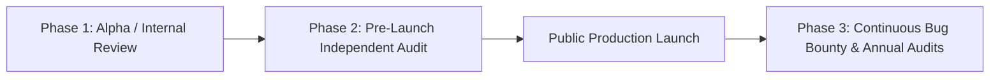

# 16. Security Audit Requirements, Methodology & Cost Benchmarks

## 1. Why Third-Party Audits Are Essential for E2EE Products

In security-focused software, **self-certification is worthless**. A developer claiming "Our software is 100% unbreakable" has zero credibility in the privacy community. 

Public trust is built strictly on:
1. Complete source code transparency on GitHub.
2. Unredacted, publicly accessible audit reports issued by renowned, independent cybersecurity research firms.
3. Rapid remediation of all discovered vulnerabilities with transparent public CVE/security advisory disclosures.

---

## 2. Audit Phases & Scope Matrix

| Audit Type | Technical Scope | Target Timing | Expected Deliverable |
| :--- | :--- | :--- | :--- |
| **1. Cryptographic Protocol Audit** | Key derivation (Argon2id), envelope encryption, nonce randomness, memory zeroization, HKDF key separation. | End of Phase 1 (Alpha) | Mathematical verification report; validation of zero key-leakage in memory dumps. |
| **2. Source Code & Client Audit** | Full codebase review (React, WebCrypto, SQLite WASM, Capacitor/Tauri, Rust/Kotlin). | Pre-Beta Launch | Line-by-line vulnerability assessment (XSS, prototype pollution, injection). |
| **3. Mobile & Enclave Audit** | Android Keystore, iOS Keychain, biometric hooks, `FLAG_SECURE`, APK/IPA reverse engineering. | Pre-App Store Submission | Mobile security verification against OWASP MASVS (Mobile App Security Verification Standard). |
| **4. Cloud Edge & API Pen Test** | Cloudflare Workers API, D1 database injections, authentication replay, rate limit bypass, DoS resistance. | Pre-Production Launch | Black-box & white-box penetration testing report. |
| **5. Supply-Chain & Dependency Audit** | Analysis of all npm dependencies, lockfile tampering, malicious transitives. | Continuous / CI-integrated | Dependency risk scorecard and automated SBOM (Software Bill of Materials). |

---

## 3. Reputable Cybersecurity Audit Firms & Market Pricing (2026 Rates)

| Security Firm | Specialization / Reputation | Estimated Cost Range (USD) | Notable Client Audits | Suitability for FrankDiary |
| :--- | :--- | :---: | :--- | :--- |
| **Cure53 (Germany)** | World-renowned for E2EE, browser crypto, and messaging. | **\$25,000 – \$50,000** | Standard Notes, ProtonMail, Bitwarden, ExpressVPN, Wire | **TOP RECOMMENDATION for Cryptographic Audit** |
| **Trail of Bits (USA)** | High-assurance software, cryptography, compilers. | **\$40,000 – \$75,000** | Notesnook, Kubernetes, Signal, Tor Browser | Excellent, high-tier |
| **Radically Open Security (Netherlands)** | Non-profit, fully transparent open-source penetration testing. | **\$15,000 – \$30,000** | Nextcloud, Mullvad, Wireguard | **BEST VALUE for Open-Source Pre-Launch Audit** |
| **Quarkslab (France)** | Binary analysis, mobile reverse engineering, hardening. | **\$30,000 – \$60,000** | VLC, Matrix/Element | Specialized for native mobile |
| **CERT-In Empanelled Auditors (India)** | Indian regulatory compliance, ISO 27001, Indian government audits. | **\$5,000 – \$12,000** (₹4 Lakh – ₹10 Lakh) | Indian banks, government portals, fintechs | **Essential for DPDP Act 2023 verification in India** |

---

## 4. Bootstrapping Audit Strategy for MVP on a Budget

A seed-stage startup cannot spend \$50,000 on Cure53 before having paying customers. The pragmatic bootstrapping strategy:

1. **Phase A (MVP Launch):**
   * Rely on **pre-audited dependencies**: `@noble/ciphers` (audited by Cure53), `libsodium` (audited), and `WebCrypto` (audited by browser vendors).
   * Automated static code analysis via **Semgrep**, **SonarQube**, and **CodeQL** in GitHub Actions.
   * Engage a qualified **Indian CERT-In empanelled boutique security firm** for an initial \$5,000–\$8,000 code and API assessment.
2. **Phase B (At 5,000 Users / \$15,000 MRR):**
   * Commission a full cryptographic and client audit from **Radically Open Security** or **Cure53**.
   * Publish the raw PDF report directly in the GitHub repository and on `diary.frankbase.com/security-audit`.
3. **Phase C (Ongoing Bug Bounty):**
   * Launch a coordinated vulnerability disclosure program on **HackerOne** or self-hosted via `security.txt` offering \$250–\$2,500 bounties for critical cryptographic bypasses.
