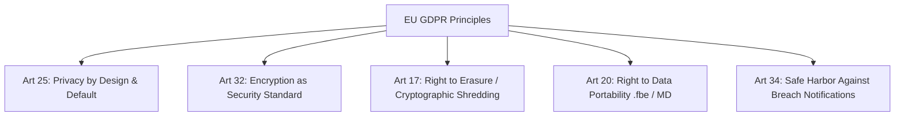

# 18. International Privacy Regulations & Safe-Harbor Protections (GDPR, UK GDPR, CCPA/CPRA)

## 1. Global Regulatory Landscape Overview

Because FrankDiary will be available worldwide via public web, App Store, and Google Play, the architecture must comply with the world's most stringent international privacy standards:
1. **EU General Data Protection Regulation (GDPR - Regulation 2016/679)**
2. **United Kingdom GDPR & Data Protection Act 2018**
3. **California Consumer Privacy Act (CCPA) as amended by the CPRA**

---

## 2. European Union GDPR Compliance Architecture

### Article 25: Data Protection by Design and by Default
FrankDiary is the textbook embodiment of Article 25. Privacy is not a marketing setting buried in menus; it is structurally hardcoded into the cryptographic pipeline before any data leaves the client.

### Article 32: Security of Processing
Article 32(1)(a) explicitly cites **"the pseudonymisation and encryption of personal data"** as the primary technical measure to ensure a level of security appropriate to the risk. FrankDiary's client-side authenticated encryption satisfies Article 32 to the highest standard.

### Article 34(3)(a): The "Encrypted Data" Breach Safe Harbor
Under standard GDPR rules, a data breach affecting user data requires notifying every individual user within 72 hours.
* **The Critical Safe Harbor:** Article 34(3)(a) states that communication to data subjects is **NOT required** if:
  > *"The controller has implemented appropriate technical protection measures, and those measures were applied to the personal data affected by the personal data breach, in particular those that render the personal data unintelligible to any person who is not authorised to access it, such as encryption."*
* **What this means for FrankBase:** If a malicious hacker dumps the entire Cloudflare database, FrankBase is **legally protected from catastrophic user panic notices** because the leaked data is mathematically unintelligible ciphertext.

### Article 17: Right to Erasure & Cryptographic Shredding
* Users can trigger account deletion in the settings.
* In addition to deleting server database rows, **Cryptographic Erasure (Crypto-Shredding)** is achieved: deleting the user's encrypted `WrappedDEK` permanently renders any historical backups or transient server logs permanently undecryptable.

### Article 20: Right to Data Portability
FrankDiary's native Markdown, JSON, and PDF local export options completely fulfill Article 20 without restricting the user to a proprietary vendor format.

---

## 3. California Consumer Privacy Act (CCPA / CPRA)

### Safe-Harbor Protection Against Private Right of Action
Under California Civil Code § 1798.150(a)(1), consumers have a private right of action to sue businesses for statutory damages of **\$100 to \$750 per consumer per incident** if their personal information is subjected to unauthorized access or exfiltration.
* **The Legal Exception:** The statute explicitly applies only to personal information that is:
  > **"...nonencrypted and nonredacted."**
* Because FrankDiary client-side encrypts all sensitive journal records, **FrankBase is completely shielded from California private class-action data breach lawsuits** regarding diary content.

### Notice at Collection & "Do Not Sell My Personal Information"
* FrankDiary does not sell, share, or monetize personal information.
* FrankDiary includes a clear `Do Not Sell or Share My Personal Information` disclosure and honors the Global Privacy Control (GPC) browser signal.

---

## 4. Other Jurisdictions: PIPEDA (Canada) & Australia Privacy Act

* **Canada (PIPEDA):** Complies with Principle 7 (Safeguards) by matching sensitivity of diary entries with military-grade encryption.
* **Australia (Privacy Act 1988 & Notifiable Data Breaches scheme):** Consistent with Australian Information Commissioner (OAIC) guidance that encrypted data breaches do not constitute an "eligible data breach" if keys remain secure.
