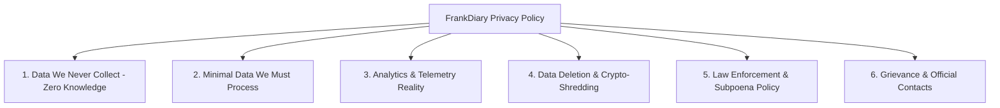

# 19. Public Privacy Policy Specifications & Disclosures

## 1. Architectural Philosophy in Policy Drafting

Most SaaS privacy policies are deceptive: they claim "We take your privacy seriously" while burying clauses that grant broad rights to share data with "trusted third-party partners and AI research affiliates."

FrankDiary's Privacy Policy must be **radically transparent, plain-spoken, and mathematically aligned with the codebase**.

---

## 2. Mandatory Structural Sections for FrankDiary Privacy Policy

### Section 1: The Zero-Knowledge Guarantee (What We CANNOT Access)
* **Explicit Content Exemption:**
  > *"We cannot read, decrypt, parse, or scan your diary entries, titles, tags, mood trackers, voice notes, or photo attachments. Your decryption keys are derived entirely on your device and are never sent to our servers. Because we do not possess your keys, we have zero mathematical ability to disclose your journal entries to anyone, including our own engineers, cloud providers, or government authorities."*

### Section 2: Minimal Data We Process (When Cloud Sync Is Enabled)
* **Account Credentials:** Email address (used purely for account identification and billing receipts).
* **Cryptographic Vault Metadata:** 
  * Random 128-bit Salt.
  * Encrypted Data Encryption Key (`WrappedDEK`).
  * Blinded Vault Identifier (`VaultToken`).
  * Encrypted Event Log (Opaque ciphertext blobs and Lamport sequence numbers).
* **Payment Information:** Processed securely through our payment provider (**Dodo Payments**). FrankBase never stores full credit card numbers or banking secrets.

### Section 3: Telemetry, Logs & Third-Party Trackers
* **Zero Third-Party Commercial Trackers:** No Google Analytics, no Facebook/Meta Pixel, no Hotjar, no Mixpanel, no Adjust/AppsFlyer.
* **Server Logs:** Cloudflare Edge logs retain standard HTTP connection data (IP address, request method, user agent, response status) for a maximum rolling window of **7 days** strictly for DDoS prevention, rate limiting, and server health. Logs are permanently purged thereafter.
* **Crash Reports:** Opt-in only. Crash reports contain only application stack traces and device OS version; they **never capture memory dumps containing diary text or encryption keys**.

### Section 4: Data Retention, Portability & Deletion
* **Immediate Local Export:** Users can export all entries at any time to Markdown, JSON, PDF, or encrypted `.fbe` format.
* **Account Deletion:** Clicking "Delete Account" executes an atomic deletion of all user records, wrapped keys, and encrypted blobs from Cloudflare D1 and R2 within 60 seconds.
* **Cryptographic Shredding:** Because the cloud-stored `WrappedDEK` is destroyed, any residual distributed database snapshots become permanently unreadable random noise.

### Section 5: Legal Requests, Court Orders & Subpoenas
* **Transparency Commitment:** FrankBase complies with lawful, authenticated court orders issued by competent jurisdictions.
* **The Technical Boundary:**
  > *"If served with a valid subpoena or court order, we can only produce the limited metadata we possess (account creation date, billing records, and opaque ciphertext blobs). We cannot provide plaintext diary content because we do not hold the mathematical keys to decrypt it. We cannot be compelled to write backdoor software that breaks client-side zero-knowledge encryption."*

### Section 6: Official Identity & Contact Channels
* **Publisher:** FrankBase Ecosystem (A unit of Master Manikant Yadav).
* **Support Desk:** `support@frankbase.com`
* **Legal & Grievance Desk:** `legal@frankbase.com`
* *(Adhering strictly to Ecosystem Rule 9: The founder's private personal email is never exposed).*
