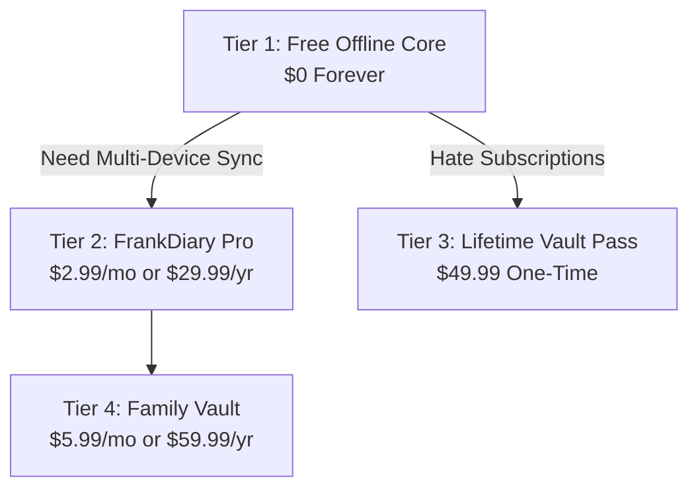

# 20. Business Model, Pricing Architecture & Unit Economics

## 1. Monetization Philosophy: The Anti-Surveillance SaaS

The vast majority of digital consumer software operates on an unethical business model: providing a "free" service by harvesting personal behavioral profiles and selling targeted ad placements.

FrankDiary adopts a **Transparent Software-as-a-Service & Digital Ownership Model**:
* **Free Offline Core:** Users who choose not to use cloud sync pay **\$0 forever**. They are not treated as products; there are zero advertisements and zero tracking.
* **Paid Edge Sync Infrastructure:** Users who want multi-device synchronization and automated encrypted cloud backups pay a fair, low-cost subscription that covers infrastructure and active development.

---

## 2. Product Tier Breakdown & Feature Matrix

| Feature / Capability | Free Offline Core | FrankDiary Pro (Cloud Sync) | Lifetime Vault Pass | Family Vault Plan |
| :--- | :---: | :---: | :---: | :---: |
| **Pricing (Global USD)** | **\$0.00 Forever** | **\$2.99 / mo** (\$29.99 / yr) | **\$49.99 One-Time** | **\$5.99 / mo** (\$59.99 / yr) |
| **Pricing (India INR)** | **₹0.00 Forever** | **₹199 / mo** (₹1,499 / yr) | **₹2,999 One-Time** | **₹399 / mo** (₹2,999 / yr) |
| **Account Required?** | ❌ No | ✅ Yes (Email token) | ❌ Optional | ✅ Yes (Up to 5 accounts) |
| **Offline Journaling** | ✅ Unlimited | ✅ Unlimited | ✅ Unlimited | ✅ Unlimited |
| **Local Encryption** | ✅ AES-256 / Argon2id | ✅ AES-256 / Argon2id | ✅ AES-256 / Argon2id | ✅ AES-256 / Argon2id |
| **Export/Import (.fbe/MD)** | ✅ Full & Unrestricted | ✅ Full & Unrestricted | ✅ Full & Unrestricted | ✅ Full & Unrestricted |
| **Multi-Device E2EE Sync** | ❌ None (Manual transfer)| ✅ Unlimited Devices | ❌ Manual (Add-on sync) | ✅ Up to 5 family members |
| **Cloud Storage Quota** | ❌ 0 MB | **10 GB Encrypted (R2)** | ❌ 0 MB (Local storage) | **50 GB Shared (R2)** |
| **Automated Version History**| ❌ Manual backups | ✅ 90-Day Revision Log | ❌ Local file history | ✅ 90-Day Revision Log |
| **Native Desktop Apps** | ✅ Web / PWA | ✅ Web + Mobile + Desktop | ✅ Full Tauri Desktop Pro | ✅ Full Multi-Platform |

---

## 3. Payment Processing via Dodo Payments

Following the FrankBase Ecosystem payment standards (Rule 20):
* **Merchant of Record (MoR):** **Dodo Payments** manages global tax compliance (EU VAT, US State Sales Tax, Indian GST), fraud prevention, and merchant settlement.
* **Global Payment Methods:** Seamless support for Credit/Debit Cards, Apple Pay, Google Pay, SEPA, and **UPI / NetBanking in India**.
* **Zero R2 Dependency for Billing:** Billing records are held exclusively on Dodo Payments; FrankDiary's edge workers receive signed webhooks to toggle the user's `is_sync_active` boolean in Cloudflare D1.

---

## 4. Unit Economics & Lifetime Value (LTV) Modeling

### Assumptions:
* **Monthly Subscription Price:** \$2.99 / month.
* **Annual Subscription Price:** \$29.99 / year (~65% of subscribers choose annual).
* **Blended Average Revenue Per User (ARPU):** \$2.60 / month.
* **Customer Churn Rate:** 4.5% monthly churn (typical for consumer productivity apps).
* **Average Customer Lifetime:** $1 / 0.045 = \mathbf{22.2 \text{ months}}$.
* **Customer Lifetime Value (LTV):** $22.2 \times \$2.60 = \mathbf{\$57.72}$.

### Gross Margin per Paid Subscriber:
* Monthly Revenue: \$2.60
* Cloudflare Hosting Cost (Workers + D1 + R2): **\$0.013 / month** (Doc 14)
* Dodo Payments Gateway Fee (~4.5% + \$0.30): ~\$0.42 / month
* Customer Support & Infrastructure Allocation: \$0.05 / month
* **Net Contribution Margin:** $\$2.60 - \$0.483 = \mathbf{\$2.117 \text{ per user / month}}$
* **Gross Profit Margin:** **81.4% (inclusive of payment gateway fees)** / **99.5% (pure hosting infrastructure margin)**.

---

## 5. Viral Organic Customer Acquisition (Zero CAC Strategy)

Instead of burning capital on Google and Meta ads:
1. **The Free Offline Trojan Horse:** Providing the world's most polished, completely free offline diary without ads attracts privacy enthusiasts from Reddit (`r/privacy`, `r/selfhosted`, `r/journaling`), Hacker News, and Product Hunt.
2. **Open-Source Developer Advocacy:** Publishing the cryptographic specifications and `.fbe` container format builds immediate organic trust on GitHub and tech Twitter/X.
3. **Authentic Review & Social Rewards (Rule 23):** Users who review the app or recommend it earn free storage boosts or extended cloud trials.
