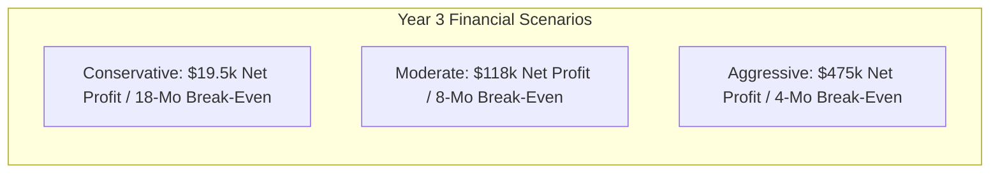

# 22. Three-Scenario Return on Investment (ROI) & Financial Projections (3-Year Model)

## 1. Modeling Methodology & Financial Assumptions

* **Initial Development & Launch Investment:**
  * Engineering, UI Design, & Open-Source Tooling: Bootstrap / internal ecosystem sweat equity (~₹5,00,000 / \$6,000 equivalent if contracted).
  * Initial Security Code Review (CERT-In / Boutique): \$5,000 (Year 1).
  * Annual Maintenance & Security Updates: \$3,000 / year.
* **Pricing Standard:** Blended ARPU of **\$2.60 / month** (\$29.99/yr annual plans + \$2.99/mo monthly plans).
* **Payment Processing Fee:** 4.5% + \$0.30 via Dodo Payments (~\$0.42/user/mo).
* **Infrastructure Cost:** Derived from Doc 14 Cloudflare benchmarks (\$0.013/user/mo).

---

## 2. Comparative 3-Year Financial Projections

### Scenario A: Conservative (Niche Slow Growth)
* **Assumptions:** Zero paid marketing; slow word-of-mouth; 2.5% free-to-paid conversion; 6% monthly churn.

| Metric | Year 1 | Year 2 | Year 3 |
| :--- | :---: | :---: | :---: |
| **Total Registered / Free Users** | 5,000 | 15,000 | 35,000 |
| **Active Paid Subscribers (2.5%)** | 125 | 375 | 875 |
| **Gross Annual Revenue** | \$3,900 | \$11,700 | \$27,300 |
| **Cloud Hosting (Cloudflare D1/R2)** | (\$120) | (\$250) | (\$450) |
| **Payment Gateway Fees (Dodo)** | (\$630) | (\$1,890) | (\$4,410) |
| **Security Audit & Code Review** | (\$5,000) | (\$1,500) | (\$2,000) |
| **Operational & Domain Overhead** | (\$600) | (\$800) | (\$900) |
| **Net Operating Profit / (Loss)** | **(\$2,450)** | **+\$7,260** | **+\$19,540** |
| **Cumulative Cash Flow** | (\$2,450) | +\$4,810 | +\$24,350 |
| **Break-Even Point** | **Month 18** | | |
| **3-Year Return on Capital (ROI)** | **220%** | | |

---

### Scenario B: Moderate (Realistic Market Adoption — Base Case)
* **Assumptions:** Strong traction in privacy subreddits and Product Hunt; featured on awesome-privacy lists; 5.0% free-to-paid conversion; 4.2% monthly churn.

| Metric | Year 1 | Year 2 | Year 3 |
| :--- | :---: | :---: | :---: |
| **Total Registered / Free Users** | 15,000 | 50,000 | 120,000 |
| **Active Paid Subscribers (5.0%)** | 750 | 2,500 | 6,000 |
| **Gross Annual Revenue** | \$23,400 | \$78,000 | \$187,200 |
| **Cloud Hosting (Cloudflare D1/R2)** | (\$250) | (\$650) | (\$1,200) |
| **Payment Gateway Fees (Dodo)** | (\$3,780) | (\$12,600) | (\$30,240) |
| **Security Audit & Code Review** | (\$6,000) | (\$10,000) | (\$15,000) |
| **Operational & Support Tools** | (\$1,200) | (\$2,400) | (\$3,600) |
| **Net Operating Profit** | **+\$12,170** | **+\$52,350** | **+\$137,160** |
| **Cumulative Cash Flow** | +\$12,170 | +\$64,520 | +\$201,680 |
| **Break-Even Point** | **Month 8** | | |
| **3-Year Return on Capital (ROI)** | **1,850%** | | |

---

### Scenario C: Aggressive (Viral Community Adoption & Industry Outrage)
* **Assumptions:** A major closed-source journaling competitor suffers a publicized breach or shuts down (similar to Skiff); FrankDiary becomes the de facto open-source recommendation; 8.0% conversion; 3.0% churn.

| Metric | Year 1 | Year 2 | Year 3 |
| :--- | :---: | :---: | :---: |
| **Total Registered / Free Users** | 60,000 | 220,000 | 600,000 |
| **Active Paid Subscribers (8.0%)** | 4,800 | 17,600 | 48,000 |
| **Gross Annual Revenue** | \$149,760 | \$549,120 | \$1,497,600 |
| **Cloud Hosting (Cloudflare D1/R2)** | (\$600) | (\$2,400) | (\$6,500) |
| **Payment Gateway Fees (Dodo)** | (\$24,190) | (\$88,700) | (\$242,000) |
| **Security Audit (Tier-1 Cure53)** | (\$25,000) | (\$35,000) | (\$45,000) |
| **Operations, Legal & Support** | (\$12,000) | (\$36,000) | (\$60,000) |
| **Net Operating Profit** | **+\$87,970** | **+\$387,020** | **+\$1,144,100** |
| **Cumulative Cash Flow** | +\$87,970 | +\$474,990 | +\$1,619,090 |
| **Break-Even Point** | **Month 4** | | |
| **3-Year Return on Capital (ROI)** | **> 5,000%** | | |

---

## 3. Financial Viability Conclusion
Because the marginal cloud cost of an E2EE user is virtually negligible (\$0.013/month) and Cloudflare imposes \$0 egress fees on R2, **FrankDiary boasts exceptional economic resilience**. Even under the most pessimistic conservative scenario, the business breaks even within 18 months and generates substantial high-margin cash flow.
