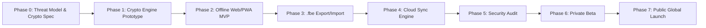

# 24. Technical MVP Definition & 8-Phase Engineering Roadmap

## 1. The Lean MVP Strategy: "Rock-Solid Offline First"

The fatal mistake of many failed privacy startups is attempting to build distributed multi-device cloud synchronization, real-time collaboration, native mobile apps, and enterprise billing all in version 1.0. This introduces massive attack surfaces and leads to endless delays.

FrankDiary adopts a **Staged Phasing Strategy**:
* **The MVP delivers Mode 1 (100% Offline Diary) and Mode 2 (Portable Encrypted Backups) with world-class polish.**
* Users can immediately use the product on Web/PWA with zero accounts, zero cloud dependencies, and absolute mathematical security.
* Mode 3 (Cloud Sync) is introduced in Phase 4 once the local cryptographic foundation has been verified and stress-tested.

---

## 2. Realistic Technical MVP Scope (Phases 1–3)

### What is INCLUDED in the MVP:
* **Mode 1 Fully Offline:** Instant local diary, zero cloud registration, zero analytics.
* **Cryptographic Core:** Argon2id key derivation, AES-256-GCM authenticated encryption, ephemeral RAM zeroization.
* **Local Persistence:** High-performance SQLite WASM with Origin Private File System (OPFS) fallback to IndexedDB.
* **Rich Text Journaling:** Clean, focused writing interface (TipTap), markdown shortcuts, mood logging, calendar date navigation.
* **Instant Client-Side Search:** In-memory MiniSearch over decrypted entries (sub-15ms BM25 ranking).
* **Mode 2 Encrypted Portability:** Full `.fbe` container export and import with authenticated tampering checks.
* **Anti-Lock-in Plaintext Export:** Single-click export to Markdown files with YAML frontmatter + structured JSON.
* **Accessibility & UI:** Complete Day/Night theme toggle meeting WCAG 2.1 AA contrast standards (Rule 11).

### What is INTENTIONALLY DEFERRED (Post-MVP):
* Cloudflare Workers multi-device cloud sync (Phase 4).
* Real-time WebRTC QR code key pairing (Phase 4).
* Native iOS/Android App Store wrappers (PWA with standalone home-screen installation serves mobile in MVP).
* Asymmetric multi-user note sharing (Post-launch optional feature).

---

## 3. Comprehensive 8-Phase Roadmap Breakdown

| Phase | Milestone Name | Key Deliverables | Estimated Duration | Primary Dependencies | Major Risks |
| :-: | :--- | :--- | :---: | :--- | :--- |
| **Phase 0** | **Security Research & Threat Modeling** | Threat model, cryptographic primitives, legal compliance (DPDP/GDPR), 25 research deliverables. | **COMPLETED** | System Architecture | Theoretical oversights (Mitigated via audit). |
| **Phase 1** | **Cryptographic Prototype** | Standalone TypeScript crypto module: Argon2id, envelope wrapping, Wycheproof & RFC test vector validation. | **2 Weeks** | WebCrypto API, `@noble` | Inadvertent key leaks in JS heap memory. |
| **Phase 2** | **Offline-First MVP Core** | React 18 + Vite frontend, SQLite WASM / OPFS database, TipTap editor, MiniSearch, Day/Night theme. | **3 Weeks** | Phase 1 Crypto Core | Browser OPFS quota drops in private browsing tabs. |
| **Phase 3** | **Portable Export & Import** | `.fbe` container packaging, drag-and-drop import, merge conflict UI, Markdown + YAML ZIP export. | **2 Weeks** | Phase 2 Storage Layer | Corrupted ZIP headers on massive photo attachments. |
| **Phase 4** | **Zero-Knowledge Cloud Sync** | Cloudflare Workers API, D1 event log, R2 media storage, blind tokens, Lamport conflict engine. | **4 Weeks** | Phase 1–3 Codebase | Network partition desynchronization bugs. |
| **Phase 5** | **Security Audit & Hardening** | Static code analysis, penetration testing, independent third-party code review (CERT-In / Boutique). | **3 Weeks** | Phase 4 Sync Engine | Discovered cryptographic vulnerabilities requiring refactoring. |
| **Phase 6** | **Private Community Beta** | Invite-only rollout to 500 privacy enthusiasts (r/privacy, Hacker News); bug bounty triage. | **3 Weeks** | Phase 5 Audit Approval | Unexpected device edge cases (old Android WebViews). |
| **Phase 7** | **Public Production Launch** | Global launch on `diary.frankbase.com` / `od.frankbase.com`, Dodo Payments billing, open-source repo release. | **2 Weeks** | Phase 6 Beta Polish | Sudden viral traffic spikes (handled by Cloudflare edge). |
| **Total** | **MVP to Production Launch** | **Complete Zero-Knowledge Offline-First Ecosystem** | **~19 Weeks** (4.5 Months) | Full-Stack Execution | Execution discipline. |
